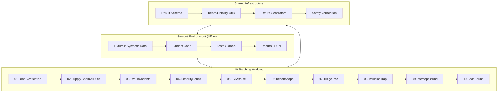

# Agentic Security Demos

[](https://github.com/radanliev/agentic-security-demos/actions/workflows/ci.yml)
[](https://opensource.org/licenses/MIT)
[](https://www.python.org/downloads/)
[](https://doi.org/10.5281/zenodo.XXXXXX)
[]()
[]()

**A collection of 10 educational modules for teaching security concepts in agentic AI systems — all demonstrations use local synthetic fixtures only (no live network access, real credentials, malware, or private data).**

---

## 🎯 Why This Exists

Agentic AI systems introduce novel security challenges: confused deputies, prompt injection, supply chain drift, and evaluation gaming. **Existing resources focus on LLM capabilities, not agentic security engineering.** This repository fills that gap with hands-on, offline-first teaching modules that let students *experience* the vulnerabilities and implement defenses — without ever touching a live network or real credentials.

**Core thesis**: You cannot secure what you cannot simulate. These modules let students *be* the attacker and the defender in a hermetic environment.

---

## 🏗️ Architecture Overview



---

## 🚀 Quickstart (3 Steps)

```bash
# 1. Clone & enter
git clone https://github.com/radanliev/agentic-security-demos.git
cd agentic-security-demos

# 2. One-time setup (installs deps, generates fixtures)
make setup

# 3. Run a demo (01–10) or all tests
make demo DEMO=01    # Blind Verification
make demo DEMO=05    # Evidence-Backed Release
make test            # All 170 tests (offline, deterministic)
```

> **Requirement**: Python 3.11+, `make`, `git`. No network access required after clone.

---

## 📚 Demos Overview

| # | Module | Core Concept | Key Insight | Time |
|---|--------|--------------|-------------|------|
| **01** | [Blind Verification](demo-01-blind-verification/) | Commit-before-test oracle evaluation | Post-hoc explanations are unverifiable | 30 min |
| **02** | [Supply Chain AIBOM](demo-02-supply-chain-aibom/) | Drift detection & policy gates | Drift = runtime ≠ declaration | 30 min |
| **03** | [Eval Invariants](demo-03-eval-invariants/) | 5 executable evaluation checks | High score + failed invariant = weak eval | 45 min |
| **04** | [AuthorityBound](demo-04-authoritybound/) | Confused deputy, provenance, capabilities | Data ≠ authority | 45 min |
| **05** | [EVIAssure](demo-05-eviassure/) | Hash chains, Merkle trees, signed receipts | Tamper-evident release evidence | 45 min |
| **06** | [ReconScope](demo-06-reconscope/) | Network recon with provenance | Network data = observation, not instruction | 30 min |
| **07** | [TriageTrap](demo-07-triagetrap/) | Safe malware triage, base-rate awareness | Metadata ≠ authority | 30 min |
| **08** | [InclusionTrap](demo-08-inclusiontrap/) | LFI/RFI, scope boundaries | Reading ≠ executing | 45 min |
| **09** | [InterceptBound](demo-09-interceptbound/) | Taint tracking, ephemeral buffers | Taint blocks privileged actions | 45 min |
| **10** | [ScanBound](demo-10-scanbound/) | Vuln scan scope, AST validation | Taint-aware downstream actions | 45 min |

---

## 🛡️ Safety Guarantees (Verified by CI)

| Property | Guarantee | Verification |
|----------|-----------|--------------|
| **Network access** | **None** | `make verify-safety` scans for imports |
| **Credentials** | **None** | Regex scan for patterns |
| **Malware** | **None** | Static analysis + manual review |
| **Private data** | **None** | Content scanning |
| **Deterministic** | Seed=42 | Re-run with same seed |
| **Fail-closed** | All gates | Tested in each demo |

> **No live network access, no real credentials, no executable malware** — all fixtures are synthetic and local.

---

## 📁 Repository Structure

```
agentic-security-demos/
├── demo-01-blind-verification/      # Blind commitment & oracle evaluation
├── demo-02-supply-chain-aibom/      # AIBOM drift detection & policy gates
├── demo-03-eval-invariants/         # 5 executable evaluation invariants
├── demo-04-authoritybound/          # Confused deputy & authority confinement
├── demo-05-eviassure/               # Cryptographic evidence pipelines
├── demo-06-reconscope/              # Network recon with provenance
├── demo-07-triagetrap/              # Safe malware triage (synthetic only)
├── demo-08-inclusiontrap/           # File inclusion & scope boundaries
├── demo-09-interceptbound/          # Traffic interception & taint tracking
├── demo-10-scanbound/               # Vulnerability scan scope control
├── shared/                          # Result schema, reproducibility, fixtures
├── docs/                            # 40+ page mkdocs site (GitHub Pages)
├── examples/                        # Cross-demo examples
├── .github/
│   ├── workflows/ci.yml             # CI: offline tests only
│   ├── ISSUE_TEMPLATE/              # Bug, feature, docs templates
│   └── PULL_REQUEST_TEMPLATE.md     # PR template with safety checklist
├── Makefile                         # Root commands (setup, test, demo)
├── pyproject.toml                   # Project metadata (PEP 621)
├── requirements.txt                 # Core deps
├── LICENSE                          # MIT License
├── CONTRIBUTING.md                  # Contribution guidelines
├── CODE_OF_CONDUCT.md               # Contributor Covenant v2.1
├── SECURITY.md                      # Security policy
├── RESPONSIBLE_USE.md               # Responsible use policy
├── CHANGELOG.md                     # Version history
├── CITATION.cff                     # Citation metadata
├── SUPPORT.md                       # Help, FAQ, community guidelines
└── .github/dependabot.yml           # Dependency updates
```

---

## 📚 Educational Use

| Level | Prerequisites | Time per Demo | Exercises |
|-------|---------------|---------------|-----------|
| **Beginner** | Basic Python, security awareness | 30-45 min | ✅ |
| **Intermediate** | CS fundamentals, basic security | 45-60 min | ✅ |
| **Advanced** | Grad-level security | 60+ min | ✅ |

Each demo includes: **Learning objectives**, **Conceptual explanation**, **Safety notice**, **Reproducibility metadata**, **Beginner/Standard/Extension exercises**, **Visible correctness tests**.

---

## 🔬 Reproducibility

Every demo run produces a standardized JSON result:

```json
{
  "demo": "demo-01-blind-verification",
  "experiment": "comparison",
  "seed": 42,
  "commit": "abc1234",
  "environment": "Python 3.11, Ubuntu 22.04",
  "command": "make demo DEMO=01",
  "result": "pass",
  "notes": "Synthetic teaching fixture"
}
```

**Record these fields in lab reports. Teaching results are demonstrations, not validated research claims.**

---

## 🤝 Contributing

We welcome contributions! See [CONTRIBUTING.md](CONTRIBUTING.md) for:
- Code style (PEP 8, type hints, Google docstrings)
- PR process (fork → branch → test → safety check → PR)
- Safety requirements (zero network, no credentials, synthetic only)
- Adding new demos (follow established pattern)

---

## 📖 Citation

If you use these materials in teaching or research, please cite:

```bibtex
@software{agentic-security-demos,
  title = {Agentic Security Demos: Teaching Modules for Agentic AI Security},
  author = {Agentic Security Demos Contributors},
  year = {2024},
  version = {0.1.0},
  url = {https://github.com/radanliev/agentic-security-demos},
  note = {Educational materials for teaching agentic AI security concepts}
}
```

See [CITATION.cff](CITATION.cff) for machine-readable citation metadata.

---

## 📜 License

MIT License — see [LICENSE](LICENSE) for details.

---

## ⚠️ Responsible Use

**Critical**: These modules teach **defensive concepts** using **safe simulations only**.
- Do NOT target public systems, real services, or third-party infrastructure
- Do NOT use real credentials, API keys, or private keys
- Do NOT execute unknown code or malware samples
- Do NOT present teaching results as peer-reviewed research findings

See [RESPONSIBLE_USE.md](RESPONSIBLE_USE.md) and [SECURITY.md](SECURITY.md) for full policies.

---

## 🙋 Support

- **Issues**: [GitHub Issues](https://github.com/radanliev/agentic-security-demos/issues)
- **Discussions**: [GitHub Discussions](https://github.com/radanliev/agentic-security-demos/discussions)
- **Security**: See [SECURITY.md](SECURITY.md) for vulnerability reporting
- **Documentation**: [GitHub Pages](https://radanliev.github.io/agentic-security-demos/) (auto-deployed)

---

**Keywords**: agentic AI, AI security, LLM security, autonomous agents, security education, teaching materials, blind verification, AIBOM, supply chain security, evaluation invariants, authority confinement, confused deputy, evidence-backed release, network reconnaissance, malware triage, file inclusion, traffic interception, vulnerability scanning, synthetic fixtures, reproducible evaluation