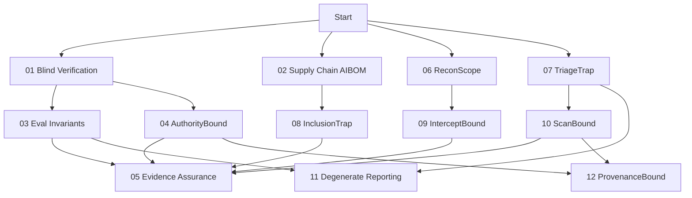

# Demos Overview

## Learning Path

## Quick Comparison

| Demo | Core Concept | Key Insight | Time |
|------|--------------|-------------|------|
| **01** | Blind Verification | Commit before seeing test | 30 min |
| **02** | AIBOM Drift | Policy gates prevent drift | 30 min |
| **03** | Eval Invariants | 5 checks for robust eval | 45 min |
| **04** | Authority Bound | Provenance = authority | 45 min |
| **05** | Evidence Assurance | Hash chains + Merkle trees | 45 min |
| **06** | ReconScope | Network data ≠ instructions | 30 min |
| **07** | TriageTrap | Metadata ≠ authority | 30 min |
| **08** | InclusionTrap | Reading ≠ executing | 45 min |
| **09** | InterceptBound | Taint tracking blocks actions | 45 min |
| **10** | ScanBound | Scope + taint = safe scanning | 45 min |
| **11** | Degenerate Reporting | Baselines that rule out doing nothing | 15 min |
| **12** | ProvenanceBound | Provenance-aware calendar authorization | 20 min |

## Common Themes

| Theme | Demos | Key Lesson |
|-------|-------|------------|
| **Provenance Tracking** | 04, 06, 07, 08, 09, 12 | Data source determines authority |
| **Fail-Closed Defaults** | 02, 04, 08, 09, 10, 12 | Default deny, explicit allow |
| **Blind Evaluation** | 01, 03, 11 | No peeking at test conditions; no free-floating headline numbers |
| **Scope Enforcement** | 02, 06, 08, 10, 12 | Explicit allowlists only |
| **Taint Tracking** | 09, 10 | Track data source through pipeline |
| **Oracle Separation** | 01, 11, 12 | Labels never drive attempts; attempts are observed |
| **Cryptographic Evidence** | 05 | Hash chains + Merkle trees |

## Prerequisites by Demo

| Demo | Python Concepts | Security Concepts |
|------|-----------------|-------------------|
| 01 | JSON, subprocess, hashing | Authorization, dependencies |
| 02 | Sets, pattern matching | Supply chain, policy gates |
| 03 | Statistics, JSON | Evaluation methodology |
| 04 | Enums, dataclasses | Confused deputy, capabilities |
| 05 | Hashing, crypto, Merkle trees | Cryptographic evidence |
| 06 | Regex, IP parsing | Network protocols, injection |
| 07 | Bayes theorem, enums | Malware triage, base rates |
| 08 | Path resolution, AST | File inclusion, LFI/RFI |
| 09 | Dataclasses, enums | Taint tracking, MITM |
| 10 | AST parsing, regex | Vuln scanning, scope control |
| 11 | Dataclasses, JSON | Meta-science: baselines, base rates, metric sanity |
| 12 | Regex, Unicode normalization, dataclasses | Provenance-aware authorization, oracle separation |

## Recommended Order

### First Time (Beginner)
1. **01** Blind Verification — Foundation: commitment before test
2. **02** Supply Chain AIBOM — Policy gates, drift detection
3. **06** ReconScope — Network data is observation, not instruction
4. **07** TriageTrap — Metadata ≠ authority

### Intermediate
5. **03** Eval Invariants — Robust evaluation design
6. **04** Authority Bound — Provenance = authority
7. **08** InclusionTrap — Reading ≠ executing
8. **09** InterceptBound — Taint tracking in pipelines

### Advanced
9. **05** Evidence Assurance — Cryptographic pipelines
10. **10** ScanBound — Scope + taint for safe automation
11. **11** Degenerate Reporting — Audit any evaluation, including your own
12. **12** ProvenanceBound — Provenance-aware authorization for untrusted content

## Cross-Demo Exercises

See [examples/](../examples/) for cross-demo integration exercises:
- Blind verification + Evidence assurance pipeline
- ReconScope + ScanBound coordinated scanning
- Authority Bound + InclusionTrap provenance chains

## Assessment Ideas

| Demo | Quiz Question | Practical Exercise |
|------|---------------|-------------------|
| 01 | Why is post-hoc explanation insufficient? | Add new scenario + oracle |
| 02 | How does waiver override deny? | Add new drift scenario |
| 03 | What does "leakage" mean? | Implement n-gram metric |
| 04 | What is confused deputy? | Add new tool + capability |
| 05 | What prevents tampering? | Add Merkle proof verification |
| 06 | Why is network data untrusted? | Add new protocol parser |
| 07 | What is base-rate fallacy? | Tune quarantine threshold |
| 08 | Reading vs executing? | Add nested inclusion test |
| 09 | What is taint tracking? | Add new frame type |
| 10 | How does scope prevent drift? | Add out-of-scope target |
| 11 | What rules out doing nothing? | Score the degenerate policy |
| 12 | Why must provenance beat the detector? | Add a paraphrase the detector misses |

## Assessment Rubric

| Level | Criteria |
|-------|----------|
| **Pass** | All tests pass, safety verified, results recorded |
| **Good** | Exercises completed, can explain key concepts |
| **Excellent** | Extensions implemented, can teach to others |

---

*Each demo includes beginner/standard/extension exercises in its `tests/` directory.*